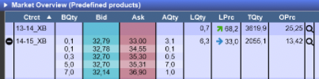

# Engineering Challenge

* [Background](#Background)
* [Energy Trading in a Nutshell](#Energy-Trading-in-a-Nutshell)
* [The Challenge](#The-Challenge)
  * [Goal](#Goal)
  * [Data Model](#Data-Model)
  * [Assignments](#Assignments)
* [Submission Instructions](#Submission-Instructions)
* [Notes](#Notes)

## Background
At flex power, software engineers:
- design, build and run reliable serverless systems.
- collaborate closely with traders to build internal tools that help them get the best outcomes on the markets, thus 
making renewables more profitable.
- work with market data to generate insights and data-driven trading decisions.

This challenge is meant to give you a taste of the type of problems our engineering team has to solve. 
It should help you decide if you might have fun working with us. 

It is also an opportunity to demonstrate your technical skills and the ability to understand and work with our domain.

## Energy Trading in a Nutshell
Energy trading happens within an **exchange**, a marketplace where traders working for energy producers 
(solar plants, nuclear power plants, ...) and consumers (B2C energy providers, big 
energy consuming industries like steel and trains...) place orders to buy and sell energy.

One of the major exchanges in Europe is called [**EPEX**](https://en.wikipedia.org/wiki/European_Power_Exchange).

These orders consist of a quantity (in MW, short for Megawatt) over a predefined period of
time, for example **delivery_hour** 12, so between 12:00 and 13:00, on a given delivery day and for a given price 
per megawatt hour (referred to as MWh).

The orders are structured within orderbooks divided in bid (buy orders) and ask (sell orders).

If the prices of two orders with opposite sides **match** (i.e the buy price is higher than the sell price), a **trade** 
is generated by the exchange and a copy is sent to both **counterparties**, the one selling and the 
one buying. 

For example if the orderbook contains an order to sell 10 MW for 10 euros/MWh and another trader 
submits an order to buy 5 MW for 11 euros/MWh, the orders are matched by the exchange and a trade is 
generated for 5 MW at 10 euros/MWh.

We keep our own trades and use the data to compute various performance indicators for our trading activities.

## The Challenge

### Goal
Build a minimal reporting application to help traders visualize how they are performing on a given trading day.

### Assignments
We want the process to be as **transparent** and **fair** as possible. The challenge is scored out of 200 points.
Each task (and bonus) has a score.

The points attributed for each task are not all or nothing. 
Partial points will be attributed for partial implementations. Don't hesitate to add anything that shows progress 
on the tasks.

**You don't have to finish all the tasks**, they are meant to represent different 
types of applications, so that you can find something that is interesting to you and you can have fun doing.
All the tasks are more or less independent, you can start wherever you want. Just make sure you specify your intentions 
in the README.

All code produced for any of these tasks should be dockerized so that we can run them easily.

#### Task 1: Web API to store and query trades (60 points)
Write a RESTful web service that can be used to store and query trades. The API should expose functionality to add new trades 
and query trades from the database.
The API should allow to query all trades and to filter based on `delivery_day` and `trader_id`.

The [OpenAPI](https://swagger.io/specification/) definition of the api can be found in `trades_api.yaml`.
The application should support authentication with username and password.

#### Task 2: Trades CSV batch importer (40 points)
Everyday at midnight, the exchange creates a file containing all of our trading activity within the past day.
For example on 2023-02-21 at around 00:00 Berlin time, the exchange would create a file called `epex_trades_20230220.csv`.
This file would contain all the trades that we performed during the previous day, i.e. 2023-02-20, in CSV format.

Write a workflow that reads these files upon their creation within a specified directory and uploads the trades to the 
database through the Rest API.
An example for the files is provided in `epex_trades_20230220.csv`.

#### Task 3: Generate reports (40 points)
Write a workflow that computes the PnL (=Profits and Losses) of a given trader.

The pnl is defined as the difference between the income made selling energy and the cost made buying it for a given hour.
If we sell energy, our income is `quantity * price` since we got money for our electricity. If we buy energy, our income is `-quantity * price`.

The pnl is 0 if no trades have been made within a given hour.

For all the hours of a given day, you should display the number of trades, the total quantity sold, the total quantity bought and finally the pnl value.
The total pnl (sum across all delivery hours) for the trading day should be displayed.

Use the terminal to display the report.

#### Bonus - Task 3 (60 points)
Display the same report within a dashboard. The dashboard should be accessible through a browser. A trader can enter 
her unique id into this application and see her daily report.

The page could look something like this:

| Hour    | Number of Trades | Total BUY [MW] | Total Sell [MW ] | PnL [Eur] |
|---------|------------------|----------------|------------------|-----------| 
| 13 - 14 | 23               | 140            | 200              | + 450     | 
| 17 - 18 | 56               | 63             | 34               | - 120     | 
| Total   | 79               | 203            | 234              | + 330     | 

## Submission Instructions
- Create a GitHub repository containing your solution and provide us with access so that we can review your code.
- Make sure to add all the necessary instructions to run the app within the readme. 
- Feel free to add any notes about technology choices and design decisions, as well as anything that we should
keep in mind when reviewing your code.

## Notes
- Spend as much time as you want on the challenge to produce something you are proud of. The intended time is more or 
less half a day, depending on your skills and level of experience with these types of applications.
- You don't have to finish all the tasks, prefer quality to quantity.
- Ideally, the deliverable should use python frameworks, since it's the language that is easiest for us to read and evaluate.
If you don't feel comfortable enough in python, or you feel that using another language would allow you to show your 
talent best, we will still take the time to review your code. Please write us first about which other language(s) you would like to use.
- The solution is important but so is everything else around it: unit tests, commit size and description, README and 
instructions to use the solution...
- If you already have similar personal projects that you would like to submit instead of this one, it's also possible.
Just make sure that you include an exhaustive documentation on what it's about and how we can start it.
